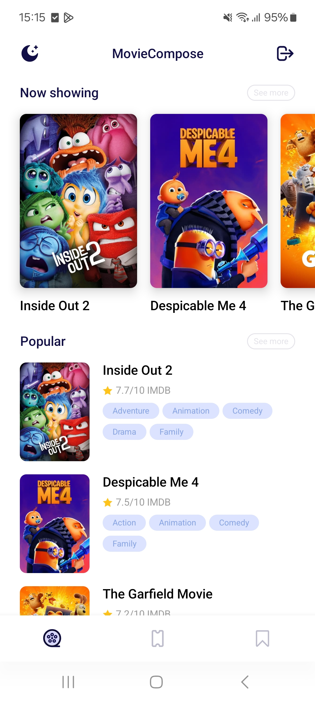
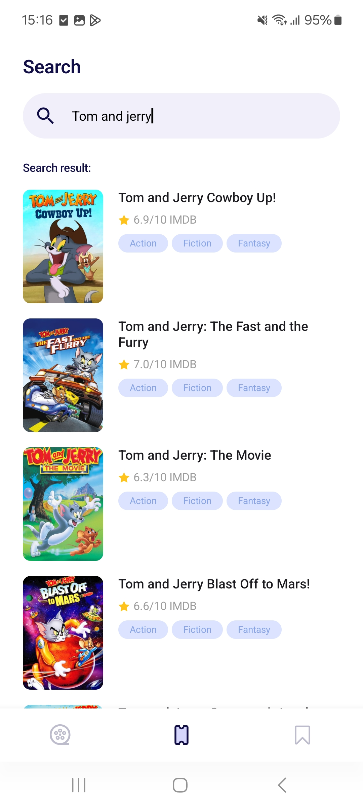
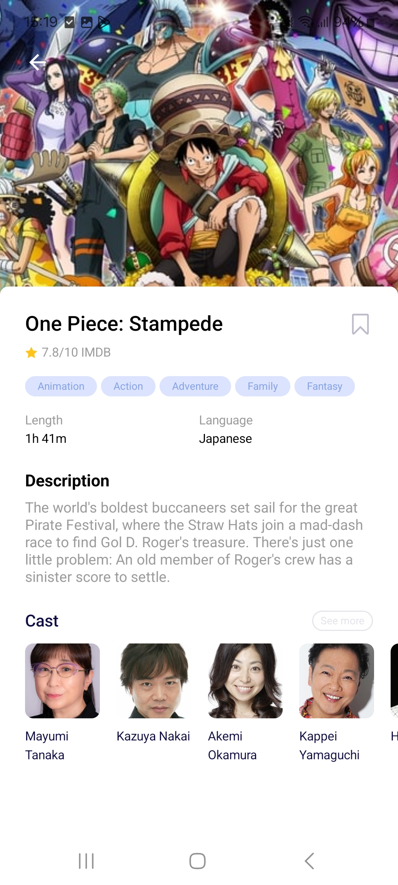

<h1 align="center">Movie Compose</h1>

  
  
  
  

 
  
  

  
A sample application demonstrates modern Android development with Jetpack Compose, Hilt, Coroutines, Flow, Room. 
Build with 💚

## Tech Stack
- Jetpack Libraries:
    - [Compose](https://developer.android.com/jetpack/compose)
    - [ViewModel](https://developer.android.com/codelabs/basic-android-kotlin-compose-viewmodel-and-state#0)
    - [Lifecycle](https://developer.android.com/develop/ui/compose/lifecycle)
    - [Navigation](https://developer.android.com/develop/ui/compose/navigation)
    - [Room](https://developer.android.com/training/data-storage/room)
    - [Paging3](https://developer.android.com/topic/libraries/architecture/paging/v3-overview)
    - [Hilt](https://developer.android.com/training/dependency-injection/hilt-jetpack)
- Others:
    - [Coil](https://coil-kt.github.io/coil/compose/)
    - [Retrofit](https://square.github.io/retrofit/)
    - [OkHttp](https://github.com/square/okhttp)
    - [Gson](https://github.com/google/gson)
    - [Coroutines](https://github.com/Kotlin/kotlinx.coroutines)

## Features
- Authentication
- View Now playing, popular movies
- View movie details
- Search movies (paging)
- Bookmark movies

## Credits
- [Design](https://www.figma.com/design/TB6uasgrsNDa40lPjqAgOD/Movie-Mobile-App-UI-Design-(Community)?node-id=3-2&t=vuBeAtwxlkAY5Ezw-0)
- [TheMovieDB](https://developer.themoviedb.org/v4/reference)